# MSME AI Copilot — Complete Project Flowchart

```mermaid
graph TD
    Start([START: Day 1]) --> DocSetup["📋 DOC SETUP<br/>Create README.md<br/>Create AGENTS.md<br/>Create /docs folder<br/>Push to GitHub"]
    
    DocSetup --> RepoInit["🏗️ REPO INIT<br/>Frontend folder<br/>Backend folder<br/>Deploy config"]
    
    RepoInit --> DeployTest["🚀 DEPLOY TEST<br/>Empty shell to Vercel<br/>Empty shell to Render<br/>Confirm links work"]
    
    DeployTest --> DeployPass{Deployed<br/>successfully?}
    DeployPass -->|No| DeployFix["🔧 Fix deploy config<br/>Retry"]
    DeployFix --> DeployTest
    DeployPass -->|Yes| DBSchema["💾 DB SCHEMA<br/>Create tables:<br/>products<br/>sales<br/>expenses<br/>suppliers<br/>customers<br/>agent_runs"]
    
    DBSchema --> SeedData["🌱 SEED DATA<br/>Realistic kirana SKUs<br/>Price in INR<br/>Sample sales/expenses<br/>Make idempotent"]
    
    SeedData --> SeedTest{Seed script<br/>runs cleanly?}
    SeedTest -->|No| SeedFix["🔧 Fix seed"]
    SeedFix --> SeedData
    SeedTest -->|Yes| Agent1["🤖 AGENT 1: Orchestrator<br/>CODEX PROMPT:<br/>- Read AGENTS.md<br/>- Read ARCHITECTURE.md<br/>- Build Orchestrator logic<br/>- Plan → Code → Self-Review → Test"]
    
    Agent1 --> Agent1Pass{Agent works<br/>end-to-end?}
    Agent1Pass -->|No| Agent1Fix["🔧 Fix & retest"]
    Agent1Fix --> Agent1
    Agent1Pass -->|Yes| Agent2["🤖 AGENT 2: Inventory<br/>CODEX PROMPT:<br/>- Stock check<br/>- Depletion forecast<br/>- Reorder suggestion<br/>- Output contract: {finding,recommendation,confidence,reasoning}"]
    
    Agent2 --> Agent2Pass{Agent returns<br/>correct JSON?}
    Agent2Pass -->|No| Agent2Fix["🔧 Fix structure"]
    Agent2Fix --> Agent2
    Agent2Pass -->|Yes| Agent3["🤖 AGENT 3: Finance<br/>CODEX PROMPT:<br/>- Budget check<br/>- Cash flow calc<br/>- Affordability verdict"]
    
    Agent3 --> Agent3Pass{Agent works?}
    Agent3Pass -->|No| Agent3Fix["🔧 Fix"]
    Agent3Fix --> Agent3
    Agent3Pass -->|Yes| Agent4["🤖 AGENT 4: Sales<br/>CODEX PROMPT:<br/>- Demand trend<br/>- Forecast next period<br/>- Contributing factors"]
    
    Agent4 --> Agent4Pass{Agent works?}
    Agent4Pass -->|No| Agent4Fix["🔧 Fix"]
    Agent4Fix --> Agent4
    Agent4Pass -->|Yes| Agent5["🤖 AGENT 5: GST<br/>CODEX PROMPT:<br/>- Tax calculation<br/>- Filing-relevant notes"]
    
    Agent5 --> Agent5Pass{Agent works?}
    Agent5Pass -->|No| Agent5Fix["🔧 Fix"]
    Agent5Fix --> Agent5
    Agent5Pass -->|Yes| Agent6["🤖 AGENT 6: Support<br/>CODEX PROMPT:<br/>- Draft WhatsApp messages<br/>- Bilingual if toggle on"]
    
    Agent6 --> Agent6Pass{Agent works?}
    Agent6Pass -->|No| Agent6Fix["🔧 Fix"]
    Agent6Fix --> Agent6
    Agent6Pass -->|Yes| Synthesizer["🤖 SYNTHESIZER<br/>CODEX PROMPT:<br/>- Merge all agent outputs<br/>- Compute confidence score<br/>- Store reasoning chain<br/>- Return final answer"]
    
    Synthesizer --> SynthPass{Synthesizer<br/>works?}
    SynthPass -->|No| SynthFix["🔧 Fix"]
    SynthFix --> Synthesizer
    SynthPass -->|Yes| Wire["⚡ WIRE AGENTS<br/>CODEX PROMPT:<br/>- Connect Orchestrator → Agents → Synthesizer<br/>- Add error handling<br/>- Add timeout fallbacks"]
    
    Wire --> WirePass{Full chain<br/>works live?}
    WirePass -->|No| WireFix["🔧 Debug flow"]
    WireFix --> Wire
    WirePass -->|Yes| UIDash["🎨 UI: Dashboard<br/>CODEX PROMPT:<br/>- React component<br/>- Business Health Score display<br/>- Question input field<br/>- Reasoning chain visualization"]
    
    UIDash --> UIPass{Dashboard<br/>renders?}
    UIPass -->|No| UIFix["🔧 Fix UI"]
    UIFix --> UIDash
    UIPass -->|Yes| UIFlow["🎨 UI: Question Flow<br/>CODEX PROMPT:<br/>- Text input OR voice input<br/>- Show agent chain live<br/>- Display final recommendation<br/>- Confidence score badge"]
    
    UIFlow --> UIFlowPass{Full flow<br/>end-to-end<br/>on deployed link?}
    UIFlowPass -->|No| UIFlowFix["🔧 Fix & redeploy"]
    UIFlowFix --> UIFlow
    UIFlowPass -->|Yes| P1Feat["⭐ P1 FEATURES<br/>(if P0 done by Day 5)<br/>1. Why? button<br/>2. Confidence score<br/>3. Undo/override<br/>4. NL DB queries<br/>5. Codex Activity Timeline<br/>6. Report Generator"]
    
    P1Feat --> WhyButton["🎨 'Why?' Button<br/>CODEX PROMPT:<br/>- Render agent_runs.reasoning_chain<br/>- Plain English explanation<br/>- No extra LLM call"]
    
    WhyButton --> ConfScore["⭐ Confidence Score<br/>CODEX PROMPT:<br/>- Per-recommendation score<br/>- Store in agent_runs<br/>- Display on UI"]
    
    ConfScore --> Undo["⭐ Undo/Override<br/>CODEX PROMPT:<br/>- Button on each recommendation<br/>- Revert to previous state<br/>- Log user override"]
    
    Undo --> NLQuery["⭐ Natural Language Queries<br/>CODEX PROMPT:<br/>- Parse NL → SQL<br/>- 'Who owes me money?'<br/>- 'Show profit last month'<br/>- Answer conversationally"]
    
    NLQuery --> Timeline["⭐ Codex Activity Timeline<br/>CODEX PROMPT:<br/>- Render /codex-logs/CODEX_LOG.md<br/>- Show planning → generation → review → test → deploy<br/>- Timeline card UI"]
    
    Timeline --> Report["⭐ Report Generator<br/>CODEX PROMPT:<br/>- Weekly report template<br/>- Fetch data from DB<br/>- Export as PDF"]
    
    Report --> P1Check{All P1 features<br/>working?}
    P1Check -->|No| P1Cleanup["🔧 Remove broken P1 features<br/>Keep P0 only"]
    P1Check -->|Yes| P2Feat["🎨 P2 FEATURES<br/>(if P0+P1 done by Day 7)<br/>1. Invoice OCR<br/>2. Multilingual<br/>3. Voice chat<br/>4. Beautiful dashboard"]
    
    P1Cleanup --> Day7QA
    P2Feat --> InvoiceOCR["🎨 Invoice OCR<br/>CODEX PROMPT:<br/>- Tesseract or Cloud Vision<br/>- Extract items/GST/total<br/>- Auto-add to inventory"]
    
    InvoiceOCR --> Multilingual["🎨 Multilingual<br/>CODEX PROMPT:<br/>- i18n setup<br/>- Hindi/English strings<br/>- Toggle component"]
    
    Multilingual --> Voice["🎨 Voice Assistant<br/>CODEX PROMPT:<br/>- Web Speech API<br/>- Ask by voice<br/>- Answer by speech"]
    
    Voice --> Dashboard["🎨 Beautiful Dashboard<br/>CODEX PROMPT:<br/>- Charts (sales/expenses)<br/>- Dark mode<br/>- Animations<br/>- Agent status cards"]
    
    Dashboard --> P2Check{All P2 features<br/>working?}
    P2Check -->|No| P2Cleanup["🔧 Remove broken P2 features"]
    P2Check -->|Yes| Day7QA["✅ DAY 7 QA PASS<br/>Fresh browser session<br/>Fresh account<br/>Run full flow end-to-end<br/>Fix all console errors"]
    
    P2Cleanup --> Day7QA
    Day7QA --> QAPass{QA clean?}
    QAPass -->|No| QAFix["🔧 Fix issues"]
    QAFix --> Day7QA
    QAPass -->|Yes| LogCodex["📝 LOG CODEX SESSIONS<br/>Write CODEX_LOG.md<br/>All sessions: plan→code→review→test<br/>Keep entry per session"]
    
    LogCodex --> RepoClean["📦 REPO CLEANUP<br/>Commit history clean<br/>No secrets/node_modules<br/>Matches deployed app"]
    
    RepoClean --> DemoRec["🎥 RECORD DEMO VIDEO<br/>Follow DEMO_SCRIPT.md<br/>3 min max<br/>Show core flow + Codex usage<br/>3 takes, pick best"]
    
    DemoRec --> GoogleDoc["📄 WRITE GOOGLE DOC<br/>Track: Theme 6<br/>Problem statement<br/>Tech stack<br/>Share: anyone with link<br/>Keep accessible"]
    
    GoogleDoc --> CheckList["✅ EVALUATION CHECKLIST<br/>Run against LIVE deployed link<br/>Viability gate checks<br/>Score self on 50/20/15/10/5 rubric"]
    
    CheckList --> CheckPass{All items<br/>done?}
    CheckPass -->|No| CheckFix["🔧 Fix remaining items"]
    CheckFix --> CheckList
    CheckPass -->|Yes| Submit["📤 SUBMIT VIA BLOCKSEBLOCK<br/>Go to dashboard<br/>Create Project<br/>Select Track: Theme 6<br/>Enter deployed link<br/>Enter GitHub link<br/>Enter demo video link<br/>Toggle both notes<br/>Click Continue<br/>Click FINAL SUBMIT"]
    
    Submit --> SubmitPass{Final Submit<br/>successful?}
    SubmitPass -->|No| SubmitDebug["🔧 Debug submission<br/>Check all links live<br/>Retry"]
    SubmitDebug --> Submit
    SubmitPass -->|Yes| Verify["✅ VERIFY SUBMISSION<br/>Dashboard → My Projects<br/>Status = Submitted (not draft)<br/>Links still live"]
    
    Verify --> End([✅ COMPLETE<br/>Submission confirmed])
```



---

## Reference: Prompt Templates by Phase

### Phase 1A: Repo Setup (Session 1)
```
You are an expert hackathon coder. Read AGENTS.md and docs/ARCHITECTURE.md.

Task: Scaffold the MSME AI Copilot repo with these folders:
/frontend (React, Tailwind)
/backend (Node/Express)
/backend/agents (empty for now, agents go here)
/docs (already have README.md, AGENTS.md here)
/codex-logs (create, will store CODEX_LOG.md)

Also create:
- Vercel config for frontend (next.config.js or similar)
- Render config for backend (.env template)
- .gitignore

Plan your approach first. Then code. Then self-review for:
- No hardcoded secrets
- Consistent folder structure
- Deploy config is correct

Don't write agent code yet, just scaffolding.
```

### Phase 1B: DB Setup (Session 2)
```
Read docs/ARCHITECTURE.md — data model section.

Task: Create backend DB schema + seed script.

Tables:
- products (id, name, category, stock_qty, reorder_threshold, unit_cost, unit_price)
- sales (id, product_id, qty, date, amount)
- expenses (id, category, amount, date)
- suppliers (id, name, product_id, lead_time_days, cost)
- customers (id, name, balance_due)
- agent_runs (id, query, agents_invoked[], reasoning_chain, final_output, confidence, timestamp)

Seed data: realistic kirana store (rice, lentils, sugar, milk, oil, salt, spices, etc.) with prices in INR.
Make seed idempotent — safe to run multiple times without duplicates.

Plan approach. Code. Self-review for:
- No data loss on re-run
- Realistic values
- Indexes on frequently-queried columns

Deploy to Render, test seed runs cleanly.
```

### Phase 2: Agent Building (Sessions 3–8, one per agent)
```
Read AGENTS.md and docs/ARCHITECTURE.md.

Task: Build the [Agent Name] Agent.

Spec:
- Input: [describe context]
- Output: { finding, recommendation, confidence, reasoning }
- Edge cases: [list from AGENTS.md]

File: /backend/agents/[agentName].js

Plan approach first:
- What data do you need from DB?
- How will you compute the recommendation?
- What are edge cases?

Then code. Then self-review your own output for:
- Correct JSON structure
- No edge case failures
- Reasonable confidence scores
- Clear reasoning text

Then write a smoke test (hard-coded test case, runs locally).

Don't integrate with other agents yet—test in isolation.
```

### Phase 3: Wiring (Session 9)
```
Read AGENTS.md, docs/ARCHITECTURE.md.

All agents (Orchestrator, Inventory, Finance, Sales, GST, Support, Synthesizer) are now built.

Task: Wire them together:
1. User query → Orchestrator
2. Orchestrator decides which agents to call, in order
3. Each agent runs, returns { finding, recommendation, confidence, reasoning }
4. Synthesizer merges outputs → final answer
5. Store in agent_runs table
6. Return to frontend

Plan approach:
- Call order (any dependencies?)
- Error handling (what if one agent fails?)
- Timeout (how long before fallback?)

Code orchestration logic. Self-review for:
- All agents called correctly
- Reasoning chain stored correctly
- No unhandled errors

Deploy and test end-to-end via API call.
```

### Phase 4: Frontend (Sessions 10–12)
```
Read AGENTS.md.

Task: Build React UI for dashboard + question flow.

Components:
1. Dashboard: Business Health Score, question input
2. Question Flow: ask → show reasoning chain → show recommendation
3. "Why?" button: render reasoning chain plainly
4. Confidence score badge
5. Undo button

Plan approach:
- Component hierarchy
- State management
- Styling (dark mode, animations)

Code. Self-review for:
- No console errors
- Responsive (mobile-friendly)
- Reasoning chain displays clearly

Deploy to Vercel. Test against live backend.
```

### Phase 5: P1 Features (Sessions 13–18, one per feature)
Follow same template as agent building — plan → code → self-review → test → deploy.

### Phase 6: Final QA + Demo
```
Task: Full end-to-end QA.

Checklist:
- Fresh browser, fresh account
- Ask 5 different questions
- All return recommendations
- No console errors
- All buttons work (Why? Undo, etc.)
- Deployed link stays up
- GitHub repo clean

After: Record 3-min demo video per DEMO_SCRIPT.md.
Write Google Doc per EVALUATION_CHECKLIST.md.
```

---

## Day-by-Day Summary

| Day | Phase | Output |
|-----|-------|--------|
| 1 (Today) | Docs + Repo Init | README.md, AGENTS.md, GitHub repo, deployed empty shell |
| 2 | DB + Seed | Schema + idempotent seed script running on deployed backend |
| 3–5 | Build Agents | Orchestrator, Inventory, Finance, Sales, GST working in isolation |
| 6 | Build Support + Synthesizer | All 6 agents complete |
| 7 (Mentor 25th) | Wire Agents | Full orchestration working end-to-end, live on deployed link |
| 8 | Frontend | Dashboard + reasoning chain UI, live |
| 9–10 | P1 Features | Why? Confidence, Undo, NL queries, Timeline, Report done and tested |
| 11 | P2 Features | Invoice OCR, Multilingual, Voice, Beautiful dashboard (or cut if behind) |
| 12 | Day 7 QA | Fresh end-to-end test, all console errors fixed, repo clean |
| 13 | Demo + Docs | Demo video recorded, Google Doc written, CODEX_LOG.md complete |
| 14 | Final Check | EVALUATION_CHECKLIST.md passed, ready to submit |
| 15 (Aug 3) | **SUBMIT** | BlockseBlock: Final Submit → Verified Submitted |

---

## Success Criteria at Each Gate

- **Repo Init**: Links open, no errors
- **DB**: Seed runs, data looks real
- **Each Agent**: Returns correct JSON, passes smoke test
- **Wiring**: Full query → reasoning chain → answer works live
- **Frontend**: No console errors, flow is clickable
- **Day 7 QA**: Fresh session, zero broken buttons
- **Submission**: Final Submit clicked, status shows Submitted

**Biggest risk**: Viability gate. If deployed link is down or core flow broken when judge tries it, you get 0 regardless of features. Keep it live 24/7 after Day 2.
